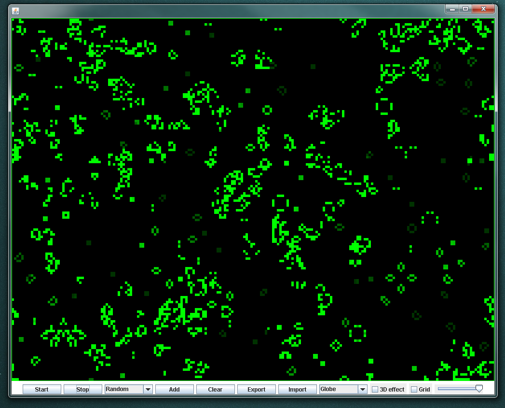
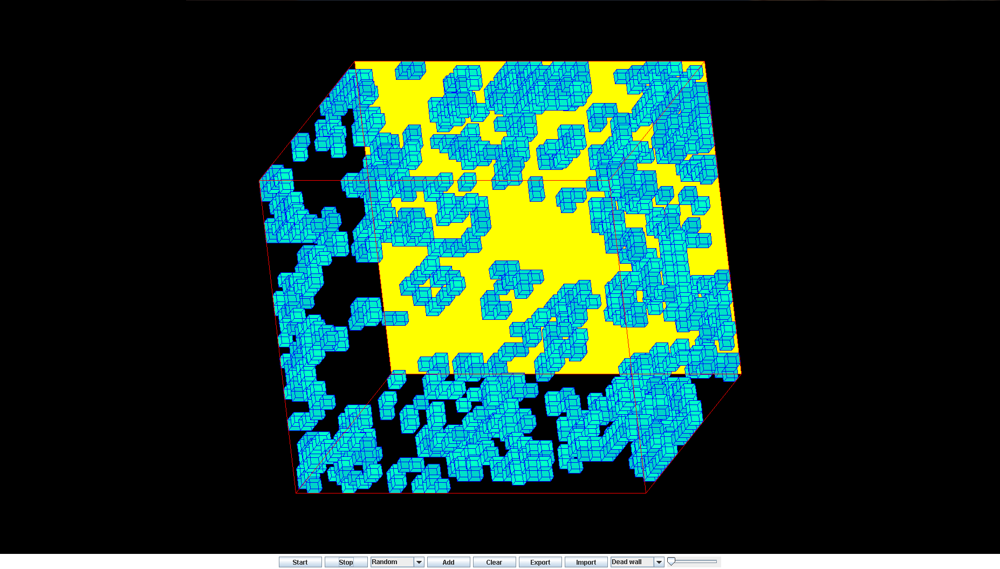

# Game of life 2D/3D
A 2D/3D Implementation of John Conways Game of Life written in Java.

*The code was written somewhere around the year 2013/2014.*

## Introduction
The Game of Life, also known simply as Life, is a cellular automaton devised by the British mathematician John Horton Conway in 1970. The "game" is a zero-player game, meaning that its evolution is determined by its initial state, requiring no further input. One interacts with the Game of Life by creating an initial configuration and observing how it evolves

The original Game of Life is in 2D, I made a 3D version and I searched for new evolution rules.

More Info about Conway’s Game of Life: [Conway's Game of Life](http://en.wikipedia.org/wiki/Conway's_Game_of_Life).

## 2D implementation screenshot

## 3D implementation screenshot

